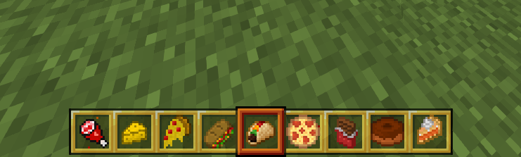

# AddFoodsMods Plugin v1.0.0

The **AddFoodsMods** plugin is an exciting addition to your PocketMine-MP server, allowing you to introduce new and diverse food items to enhance your players' gaming experience. It is compatible with **PocketMine-MP version 5.0.0**.

## Features

- Adds various new food items to the game.
- Customize food crafting recipes.
- Offers a fun way to enhance your players' gaming experience.

## Installation

1. Make sure you have **PocketMine-MP version 5.0.0 or higher** installed on your server.
2. Download the latest version of **AddFoodsMods** from [here](https://github.com/Refaltor77/AddFoods/releases/download/1.0.0/AddFoodsMods_v1.0.0.phar) or from [GitHub](https://github.com/Refaltor77/AddFoods).
3. Place the downloaded `.phar` file into your PocketMine-MP server's plugins folder.

## Usage

Players can enjoy the new food items added by the plugin while playing the game.

## Contributors

- [Your Name](https://github.com/Refaltor77) - Lead Developer

## License

This project is licensed under the [License Name](https://github.com/Refaltor77/AddFoods/blob/main/LICENSE).

## Acknowledgments

We would like to thank the PocketMine-MP community for their support and contributions to this project.

---

Feel free to customize this README by adding more details about your plugin and its functionality. Make sure to provide a valid download link and clearly specify the details of the license you have chosen for your plugin.
